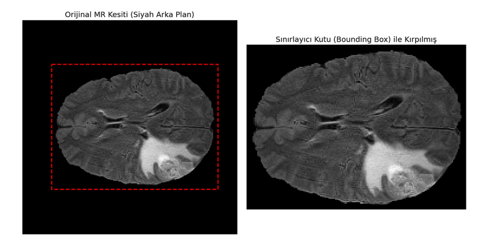
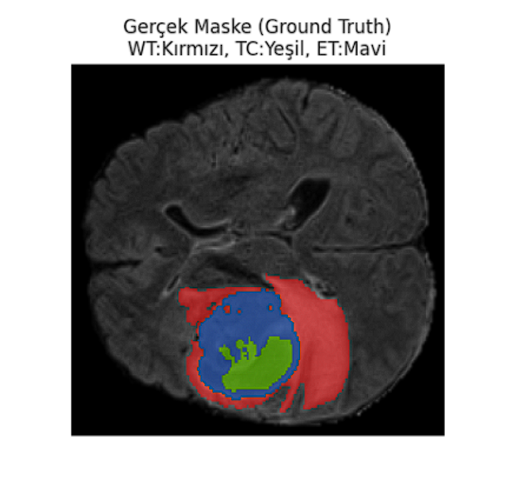
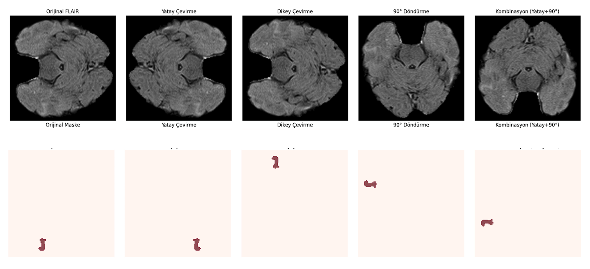
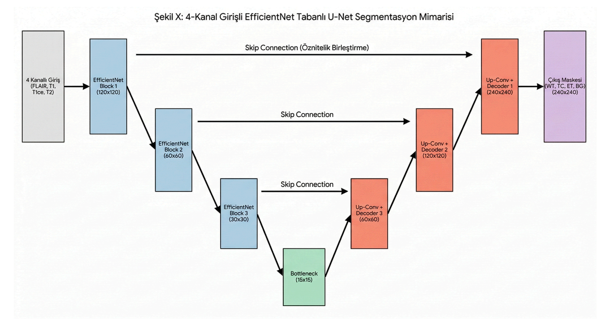
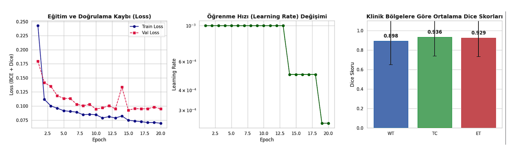
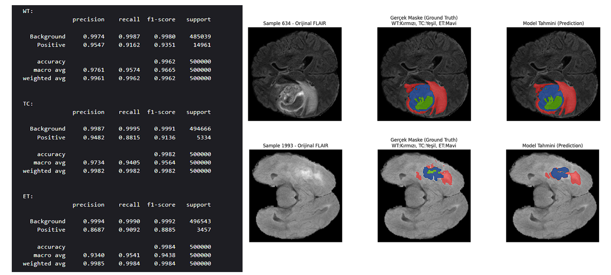

# Brain Tumor Segmentation (BraTS 2021) using U-Net & EfficientNet-B0

This repository presents a highly optimized Convolutional Neural Network (CNN) pipeline developed for multi-class brain tumor segmentation using the BraTS 2021 dataset. The project demonstrates an end-to-end deep learning architecture, focusing on memory optimization, I/O efficiency, and clinical metric evaluation.

**Developer:** Mehmet Gökgül

---

## 1. Pipeline Architecture & I/O Optimization

A significant engineering challenge in this project was overcoming the 12-hour training bottlenecks caused by heavy I/O operations and repetitive CPU-bound preprocessing. 

To resolve this, the pipeline was re-architected to decouple preprocessing from the training loop. Raw 3D NIfTI images are preprocessed, cropped, normalized, and directly converted into PyTorch tensors (`.pt`). To optimize memory footprint and disk utilization, MRI sequences are stored in `float16` precision, while segmentation masks are stored in `uint8`.

## 2. Data Preprocessing & Dynamic Cropping

Raw MRI scans contain substantial background noise (empty space) that heavily impacts computational cost and normalization statistics. A dynamic bounding box algorithm was implemented to extract only the active brain tissue with a 5-pixel safety padding.


*Figure 1: Original MRI slice (left) vs. Bounding box cropped slice focusing on active brain tissue (right).*

The cropped regions are subsequently resized to a standardized `240x240` resolution using bilinear interpolation for MRI sequences and nearest-neighbor interpolation for discrete mask labels. Z-score normalization is applied directly to these cropped matrices.

## 3. Clinical Regions & Multi-Channel Formulation

The network is configured to accept a 4-channel input tensor consisting of FLAIR, T1, T1ce, and T2 MRI sequences. The target segmentation mask is formulated into three clinically relevant regions:

1. **Whole Tumor (WT):** Labels 1, 2, and 4 (Red)
2. **Tumor Core (TC):** Labels 1 and 4 (Green)
3. **Enhancing Tumor (ET):** Label 4 (Blue)



*Figure 2: Ground truth mask illustrating the WT, TC, and ET spatial distribution on a FLAIR background.*

## 4. Data Augmentation Strategy

To prevent overfitting and improve the model's generalization capabilities, spatial augmentations are applied strictly to the training set using the `Albumentations` library. Operations include horizontal/vertical flipping, 90-degree rotations, and shift-scale-rotate transformations.


*Figure 3: Synchronized augmentation applied to both the FLAIR sequence and the corresponding segmentation mask.*

## 5. Model Architecture

The core segmentation engine is based on the U-Net architecture, significantly enhanced by integrating an `EfficientNet-B0` backbone as the encoder. 


*Figure 4: 4-Channel input U-Net architecture utilizing EfficientNet-B0 blocks and skip connections.*

* **Transfer Learning:** The encoder is initialized with ImageNet weights to accelerate convergence.
* **Hybrid Loss Function:** The network is optimized using a combined loss function mapping both spatial overlap (`Dice Loss`) and pixel-wise classification (`BCEWithLogitsLoss`).
* **Learning Rate Scheduling:** An `Adam` optimizer is paired with a `ReduceLROnPlateau` scheduler and an `EarlyStopping` mechanism (patience=10) to prevent memorization.

## 6. Quantitative Evaluation & Clinical Metrics

The model's performance was evaluated on an unseen patient-level Test set (15% of the data). A custom mathematical correction (Trap Fix) was implemented to accurately compute Dice and IoU scores for True Negative edge cases (empty slices).


*Figure 5: Training/Validation loss convergence, Learning Rate decay, and average Dice Scores across clinical regions.*

| Clinical Region | Mean Dice Score | Standard Deviation |
| :--- | :---: | :---: |
| **Whole Tumor (WT)** | 0.8980 | 0.2480 |
| **Tumor Core (TC)** | 0.9363 | 0.1975 |
| **Enhancing Tumor (ET)** | 0.9290 | 0.1943 |

## 7. Qualitative Evaluation

For radiological verification, the predicted segmentation masks are overlaid as a transparent layer (alpha=0.5) onto the original FLAIR sequences, allowing for a direct visual comparison against the expert-annotated ground truth.


*Figure 6: Qualitative comparison. Left: Original FLAIR sequence. Middle: Ground Truth mask. Right: Model Prediction.*

## 8. Installation & Usage

**1. Clone the repository and install dependencies:**
```
pip install -r requirements.txt
```
2. Execute the decoupled preprocessing pipeline:

```
python src/data_preprocessing.py
```
3. Initialize model training:
```
python src/train.py
```
4. Run inference and generate evaluation metrics/overlays:
```
python src/evaluate.py
```
